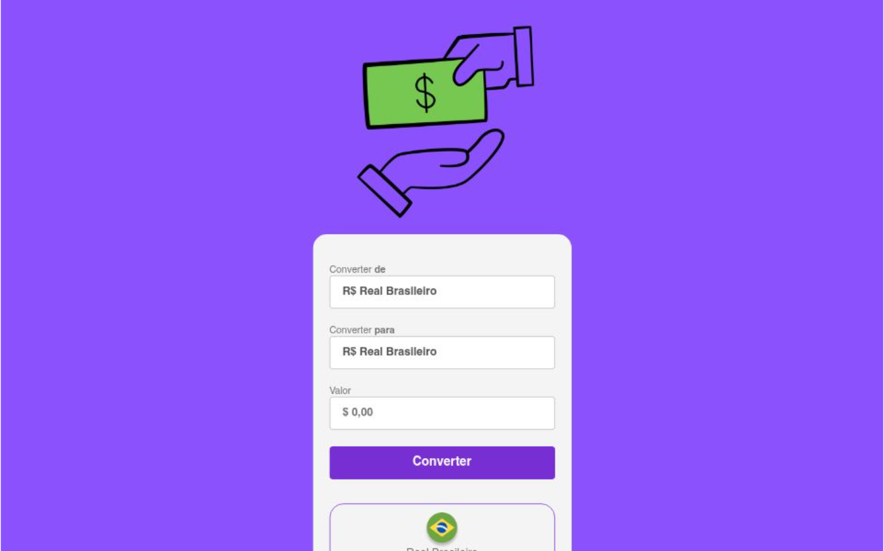

# 💸 ConvertMoney - Conversor de Moedas em Tempo Real

> Uma ferramenta dinâmica e precisa para conversão de moedas estrangeiras, com foco em usabilidade, precisão matemática e interface moderna.

## 🔗 Demonstração
**Veja o projeto online:** [Acesse aqui](https://convertmoney-six.vercel.app/)

---

## 💻 Sobre o Projeto
O **ConvertMoney** foi desenvolvido para solucionar a necessidade de conversões rápidas entre Real, Dólar e Euro. O foco principal foi a manipulação avançada do **DOM** e a lógica de cálculo para garantir que os valores fossem atualizados instantaneamente conforme a escolha do usuário. A interface segue um padrão "Clean & Professional", priorizando a clareza dos dados financeiros.

## 🛠️ Tecnologias Utilizadas
- **HTML5:** Estruturação para inputs financeiros e seletores de moeda.
- **CSS3:** Estilização moderna com foco em tipografia legível e feedback visual.
- **JavaScript (ES6+):** Lógica central de conversão, formatação de moedas (`Intl.NumberFormat`) e troca dinâmica de bandeiras/ícones.
- **Vercel:** Deploy e hospedagem.

## 🎨 Diferenciais Técnicos
- **Formatação de Moedas:** Uso de APIs nativas do JS para exibir valores com símbolos e casas decimais corretas para cada país.
- **Interatividade em Tempo Real:** Conversão disparada automaticamente ao clicar no botão, sem necessidade de recarregar a página.
- **Design Adaptável:** Interface totalmente responsiva para consultas rápidas via mobile.

## 📸 Preview

---
### 👨‍💻 Contato
**Matheus Rodrigues** [LinkedIn](https://www.linkedin.com/in/matheus-rodrigues-4398423b9) | [GitHub](https://github.com/mathrodriguesdev-arch)
